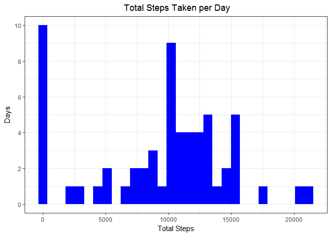
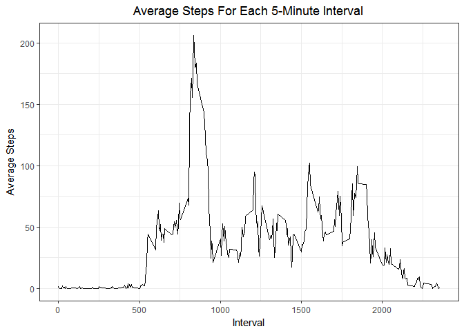
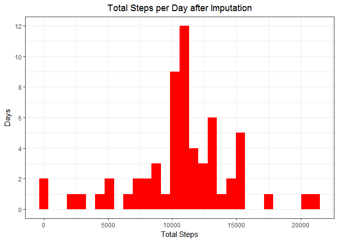
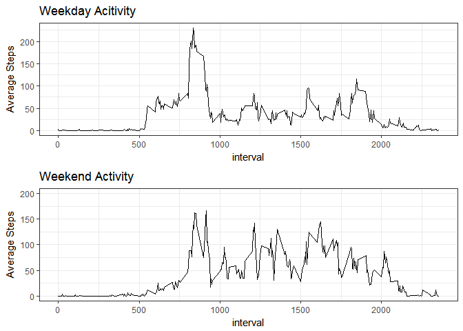

Loading and preprocessing data
------------------------------

Download the zip file to working directory and unzip it.

    if (!file.exists("activity.csv")){
      fileURL <- "https://d396qusza40orc.cloudfront.net/repdata%2Fdata%2Factivity.zip"
      download.file(fileURL, "getdata.zip")
      unzip("getdata.zip")
    }

Read the `activity.csv` file as `activity`. Check the structure of
`activity`

    activity <- read.csv("activity.csv")
    str(activity)

    ## 'data.frame':    17568 obs. of  3 variables:
    ##  $ steps   : int  NA NA NA NA NA NA NA NA NA NA ...
    ##  $ date    : Factor w/ 61 levels "2012-10-01","2012-10-02",..: 1 1 1 1 1 1 1 1 1 1 ...
    ##  $ interval: int  0 5 10 15 20 25 30 35 40 45 ...

What is the mean total number of steps taken per day?
-----------------------------------------------------

Load the dplyr library for data manipulation and ggplot2 for plotting.

    library(dplyr)
    library(ggplot2)

1.  Calculate the total number of steps taken per day.

<!-- -->

    steps_df <- activity %>% group_by(date) %>% summarise(sum_steps = sum(steps, na.rm=TRUE))

1.  Plot a histogram of total number of steps taken per day.

<!-- -->

    main <- ggplot(steps_df, aes(x=sum_steps)) + stat_bin(fill="blue") + theme_bw()
    lab <- labs(title = " Total Steps Taken per Day", x = "Total Steps", y = "Days") 
    hist_plot <- main + lab + theme(plot.title = element_text(hjust = 0.5)) + scale_y_continuous(breaks = c(0,2,4,6,8,10))
    hist_plot

1.  Calculate the mean and median of total number of steps taken
    per day.

<!-- -->

    summary(steps_df)

    ##          date      sum_steps    
    ##  2012-10-01: 1   Min.   :    0  
    ##  2012-10-02: 1   1st Qu.: 6778  
    ##  2012-10-03: 1   Median :10395  
    ##  2012-10-04: 1   Mean   : 9354  
    ##  2012-10-05: 1   3rd Qu.:12811  
    ##  2012-10-06: 1   Max.   :21194  
    ##  (Other)   :55

-   The mean and median of total number of steps taken per day are 9354
    and 10395.

What is the average daily activity pattern?
-------------------------------------------

1.  Plot the time series of average number of steps taken across all
    days (y-axis) for each 5 minute interval (x-axis)

-   First, create a new dataframe `avg_steps_df` which gives the average
    steps across all days for each interval.

<!-- -->

    avg_steps_df <- activity %>% group_by(interval) %>% summarise(avg_steps = mean(steps, na.rm=TRUE))

-   Then, use gpplot to draw the timeseries.

<!-- -->

    main1 <- ggplot(avg_steps_df, aes(x=interval, y=avg_steps)) + geom_line() + theme_bw()
    lab1 <- labs(title = "Average Steps For Each 5-Minute Interval", x = "Interval", y="Average Steps")
    time_series_plot <- main1 + lab1 + theme(plot.title = element_text(hjust = 0.5))
    time_series_plot

1.  Which 5-minute interval averaged across all days contains the
    maximum number of steps?

<!-- -->

    avg_steps_df[which.max(avg_steps_df$avg_steps),]

    ## # A tibble: 1 × 2
    ##   interval avg_steps
    ##      <int>     <dbl>
    ## 1      835  206.1698

-   Interval 835 contains the maximum number of steps on average, which
    is 206.17 steps.

Imputing missing values
-----------------------

1.  Calculate and report the total number of missing values (i.e NA) in
    the dataset.

<!-- -->

    sum(is.na(activity))

    ## [1] 2304

-   The total number of missing values is 2304.

1.  Devise a strategy to fill in all missing values in the dataset.

-   The previous time series plot suggests that for certain intervals,
    the average number of steps is consistently low - not more than 10
    steps for the intervals from 2200 to 530 (i.e 10pm to 530am).The
    average number of steps starts to increase around 600 (6am). Apart
    from the big spike from less than 100 steps to around 200 steps for
    the intervals of 800 (8am) to 900 (9am), the average number of steps
    oscilattes around 25 steps to 100 steps for each interval througout
    the day till 2000 (10pm).

-   The above suggests that, the individual has a consistent sleeping
    pattern after 10pm and wakes up after 530am. Hence, for this
    assignment, I decided to use mean number of steps across all days
    for each time interval to impute the missing values in the dataset.

1.  Create a new dataset that is equal to the original dataset but with
    the missing data filled in.

-   Merge the `activity` dataset with the `avg_steps_df` dataset by
    interval.An `activity2` dataframe is created.

<!-- -->

    activity2 <- merge(activity, avg_steps_df, by="interval")

-   Replace the missing steps with the average steps across all days for
    each time interval.

<!-- -->

    activity2$steps[which(is.na(activity2$steps))] <- activity2$avg_steps[which(is.na(activity2$steps))]

-   Do a simple check if there are any more missing values.

<!-- -->

    sum(is.na(activity2))

    ## [1] 0

-   No more missing values.

1.  Make a histogram of the total number of steps taken each day and
    Calculate and report the mean and median total number of steps taken
    per day. Do these values differ from the estimates from the first
    part of the assignment? What is the impact of imputing missing data
    on the estimates of the total daily number of steps?

-   Create dataframe `steps_df2` which stores the new total number of
    steps per day information after imputing for missing values.

<!-- -->

    steps_df2 <- activity2 %>% group_by(date) %>% summarise(sum_steps = sum(steps))

-   Use ggplot to make the histogram of total number of steps taken
    each day.

<!-- -->

    main2 <- ggplot(steps_df2, aes(x=sum_steps)) + stat_bin(fill="red") + theme_bw()
    lab2 <- labs(title = "Total Steps per Day after Imputation", x = "Total Steps", y = "Days")
    hist_plot2 <- main2 + lab2 + theme(plot.title = element_text(hjust=0.5)) + scale_y_continuous(breaks=c(0,2,4,6,8,10,12,14))
    hist_plot2

-   Calculate mean and median for total number of steps taken per day.

<!-- -->

    summary(steps_df2)

    ##          date      sum_steps    
    ##  2012-10-01: 1   Min.   :   41  
    ##  2012-10-02: 1   1st Qu.: 9819  
    ##  2012-10-03: 1   Median :10766  
    ##  2012-10-04: 1   Mean   :10766  
    ##  2012-10-05: 1   3rd Qu.:12811  
    ##  2012-10-06: 1   Max.   :21194  
    ##  (Other)   :55

-   The mean and median for total number of steps taken per day are now
    10766 and 10766. These values have increased compared to the
    previous estimates. It seems that the imputation of missing values
    have the greatest impact on the first quartile, where the first
    quartile increased from 6778 to 9819. The distribution of the total
    number of steps taken per day has become more centered.

Are there differences in activity patterns between weekdays and weekends?
-------------------------------------------------------------------------

1.  Create a new factor variable in the dataset with two levels -
    "weekday" and "weekend".

-   In order to do this, need to first convert the `date` variable
    (currently as factors) to date type. I use the lubridate package for
    easy conversion. Load the lubridate package then convert the `date`
    variable to date type. Then, create a `day` variable using
    `weekdays()`. Finally convert this `day` variable into a factor
    variable using `as.factor()`.

<!-- -->

    library(lubridate)
    activity2$date <- ymd(activity2$date)
    activity2$day <- ifelse(weekdays(activity2$date)=="Saturday" | weekdays(activity2$date)=="Sunday","weekend","weekday")
    activity2$day <- as.factor(activity2$day)                       

1.  Make a panel plot containing a time series plot of the 5-minute
    interval (x-axis) and the average number of steps taken, averaged
    across all weekday days or weekend days (y-axis).

-   Create a new dataframe `activity_all` which summarizes the average
    steps by interval and day.

<!-- -->

    activity_all <- activity2 %>% group_by(interval, day) %>% summarise(avg_steps = mean(steps))

-   To draw 2 plots, I separate them into two separate dataframes again.

<!-- -->

    activity_weekday <- activity_all %>% filter(day == "weekday")
    activity_weekend <- activity_all %>% filter(day == "weekend")

-   Load the package `gridExtra` to draw panel plots using ggplot. Use
    ggplot to plot the timeseries.

<!-- -->

    library(gridExtra)

    ## Warning: package 'gridExtra' was built under R version 3.3.3

    first_main <- ggplot(activity_weekday, aes(x=interval, y = avg_steps)) + geom_line()
    first_plot <- first_main + labs(title = "Weekday Acitivity", y = "Average Steps") + theme_bw()
    second_main <- ggplot(activity_weekend, aes(x=interval, y = avg_steps)) + geom_line()
    second_plot <- second_main + labs(title = "Weekend Activity", y = "Average Steps") + scale_y_continuous(limit = c(0, 200)) + theme_bw()
    grid.arrange(first_plot, second_plot, nrow = 2)

-   It can be seen that, the individual is more active early morning
    during weekdays (i.e activity starts about 530am. During weekends,
    the individual has a low average steps until about 8am, suggesting
    that the individual may spend more time in the bed during weekends.
    During the afternoon, the individual is more active on weekends
    compared to weekdays.
